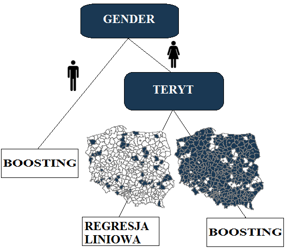
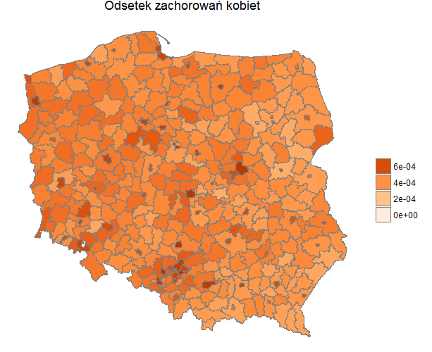
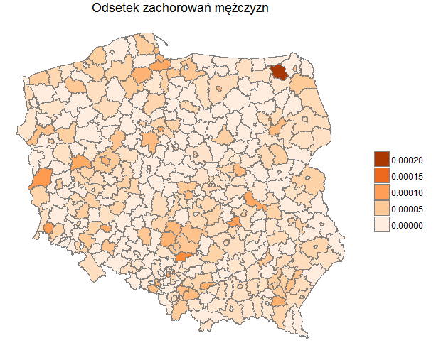

```{r, include=FALSE}
knitr::opts_chunk$set(echo = TRUE)
load(file="regresja_dane.Rdata")
library(knitr)
```

#Wprowadzenie

Celem trzeciej fazy było stworzenie modelu, który najlepiej dokona predykcji liczby zachorowań na raka piersi w Polsce na następny rok, tj. 2013 w podziale na powiat, płeć i grupę wiekową. Predykcji dokonaliśmy, bazując na danych zawierających liczbę przypadków raka piersi w Polsce w latach 2010, 2011, 2012 z podziałem na płeć, 6 grup wiekowych, fazę choroby, kod TERYT/powiat oraz województwo. Korzystając z analiz dokonanych w poprzednich fazach, uznaliśmy, że dodatkowo wykorzystamy dane z Banku Danych Lokalnych GUS - dane te opisują czynniki mogące wpływać na odsetek zachorowań.

## Przygotowanie danych
Do predykcji przygotowaliśmy dane dotyczące powiatów, gdzie zmienną objaśnianą jest znormalizowany
(przez liczbę osób w powiecie) **odsetek chorych na raka piersi**, zaś zmiennymi objaśniającymi
są czynniki wymienione w częsci poświęconej metodologii. Poniższa tabela przedstawia omawiane zmienne:
```{r}
kable(head(y11[,1:6]))
kable(head(y11[,7:12]))
kable(head(y11[,13:18]))
```

## Sposób predykcji

Zdoloność predykcyjną modeli zbadaliśmy, estymując model na podstawie danych z **2011** roku, a następnie porównujac predykcję modelu na **2012** roku z rzeczywistymi wartościami.Optymalne parmetry dobieraliśmy za pomocą przeszukiwania parametrów i ewaluacji modelu za pomocą 10-krotnej kroswalidacji. Za kryterium obraliśmy błąd RMSE. Wyniki we wszystkich tabelach zostały pomnożone przez 10^5.

```{r include=FALSE}
mse <- function(pred, y) {
  return(mean((pred-y)^2, na.rm=TRUE))
}
rmse <- function(pred, y) {
  return(sqrt(mean((pred-y)^2, na.rm=TRUE)))
}
```

#Użyte modele
Użyliśmy następujących metod:    
<ul>
<li> regresja liniowa </li>
<li> gradient boosting </li> 
</ul>

Jak się poniżej okaże, najlepiej sprawdziły się **regresja liniowa z zestawem zmiennych wybranych na podstawie kryterium BIC** oraz **gradient boosting z selekcją atrybutów**. Wybór najlepszych modeli przedstawiamy poniżej.

##Metodologia i wybór czynników

Na podstawie literatury przedmiotu, w poprzedniej fazie zauważyliśmy, że ważne są następujące czynniki:
<ul>
<li>wiek</li>
<li>płeć</li> 
<li>stężenie szkodliwych pyłów</li>
<li>stężenie szkodliwych gazów</li>
<li>urbanizacja</li> 
<li>gęstość zaludnienia</li>
</ul> 


W trzeciej fazie postanowiliśmy dodać także czynniki:
<ul>
<li>spożycie alkoholu wśród kobiet (dane dla województw)</li> 
<li>spożycie alkoholu wśród mężczyzn (dane dla województw)</li> 
<li>otyłość wśród kobiet (dane dla województw)</li> 
<li>otyłość wśród mężczyzn (dane dla województw)</li> 
<li>liczbę osób zarejestrowanych w poradniach psychologicznych (o zaburzeniach niealkoholowych i nieschizofrenicznych)</li> 
<li>liczbę osób z zaburzeniami psychicznymi (dane dla województw)</li>
<li>liczbę osób chorych w poprzednim okresie</li>
</ul>
Za jedne z najważniejszych przyczyn nowotworu złośliwego piersi jest uznawane spożycie alkoholu oraz otyłość. Z tego powodu dodaliśmy pierwsze cztery czynniki. Za bardzo ważny determinant uznawany jest również wysoki poziom stresu, który przybliżać mają zmienne opisujące liczbę osób z problemami psychicznymi. 

    
##Modele liniowe
```{r setup, include=FALSE}
knitr::opts_chunk$set(echo = TRUE)
library(glmnet)
library(knitr)
mse <- function(pred, y) {
  return(mean((pred-y)^2, na.rm=TRUE))
}
rmse <- function(pred, y) {
  return(sqrt(mean((pred-y)^2, na.rm=TRUE)))
}
```
W pierwszej kolejności oszacowaliśmy i przetestowaliśmy modele linowe. Moc predykcyjną przetestowaliśmy opisaną wyżej metodą.

Z modeli linowych na początku oszacowaliśmy zwykły model regresji. W zbiorze zmiennych objaśnianych znalazły się wszystkie rozważane przez nas zmienne, a także interakcje między wiekiem a urbanizacją. _Pierwszy_ model wykorzystywał wszystkie zmienne, _drugi_ czynniki wybrane na podstawie kryterium BIC. Otrzymano następujące modele:

```{r cars, echo=FALSE}
load(file="regresja_dane.Rdata")
fit1_normal1<-lm(zm_dec.x~ GAZY +GESTOSC+ZIELONE+ URBANIZACJA+
                   ZAGROZENIA+PYLY+GENDER*Fotytly*URBANIZACJA+
                   GENDER*Falkohol*URBANIZACJA+GENDER*Motytly+GENDER*Malkohol+
                   URBANIZACJA+as.factor(AGE_GROUP)*URBANIZACJA+nsrednia.y+zsrednia.y+nsrednia.y*URBANIZACJA+opoznienie, data=y11)

fit1_aic<-step(fit1_normal1,data=grupa_m3, direction="backward",criterion = "BIC", trace=0)
summary(fit1_normal1)
summary(fit1_aic)

```

Jak widać w obu przypadkach, za istotne zmienne, na podstawie testu t, należy uznać: urbanizację, gestość zaludnienia, wiek, poziom spożycia alkoholu wśród kobiet, a także liczbę osób zarejestrowanych w poradniach psychologicznych.  

```{r kable, echo=FALSE, warning=FALSE}
res <- data.frame(matrix(ncol=2, nrow=2))
colnames(res) <- c("model", "wyniki")
res$model <- c("normal", "aic")
res$wyniki <- c(rmse(predict(fit1_normal1,y12), y12$zm_dec.x)*10^5, 
                rmse(predict(fit1_aic,y12), y12$zm_dec.x)*10^5)
kable(res)

```

Następnie oszacowaliśmy uogólnione modele regresji: 

1) Wykorzystujące wszystkie z opracowanych przez nas zmiennych (analogicznie z pierwszym modelem regresji liniowej). 

2) Uogólnione modele regresji wykorzystujące te zmienne, których użyliśmy do oszacowania modelu regresji linowej wybranego na podstawie kryterium BIC.

Analogicznie do modeli regresji liniowej przetestowaliśmy ich moc predykcyjną.
Za współczynnik alfa przyjęliśmy:

<ul>
<li>1.0 (lasso)</li>
<li>0.5</li> 
<li>0.25</li> 
<li>0.0 (ridge)</li> 
</ul>

```{r, echo=FALSE}
f <- as.formula(zm_dec.x~ GAZY +GESTOSC+ZIELONE+ URBANIZACJA+
                  ZAGROZENIA+PYLY+Fotytly*URBANIZACJA+
                  Falkohol+Motytly+GENDER*Malkohol+
                  URBANIZACJA+as.factor(AGE_GROUP)+nsrednia.y+zsrednia.y
                +nsrednia.y*URBANIZACJA+opoznienie)
                
options(na.action='na.omit')

x1 <- model.matrix(f, y11,na.action=NULL)
x2<-as.data.frame(x1)
y1 <- na.omit(y11)
library(glmnet)

wynik_cv_lasso<-cv.glmnet(x=x1,y=as.matrix(y1[,17]), alpha=1)
wynik_cv_ridge<-cv.glmnet(x=x1,y=as.matrix(y1[,17]),alpha=0)
wynik_cv_pol<-cv.glmnet(x=x1,y=as.matrix(y1[,17]),alpha=1/2)
wynik_cv_pol1<-cv.glmnet(x=x1,y=as.matrix(y1[,17]),alpha=1/4)


y12<-subset(y12, TERYT4!=1461)
y2 <- na.omit(y12)
y21 <- y12[complete.cases(y12),]

wynik_cv_lasso_pred<-predict.cv.glmnet(object =wynik_cv_lasso,newx=model.matrix(f, y12,na.action=NULL),)
wynik_cv_ridge_pred<-predict.cv.glmnet(object =wynik_cv_ridge,newx=model.matrix(f, y12,na.action=NULL),)
wynik_cv_pol_pred<-predict.cv.glmnet(object =wynik_cv_pol,newx=model.matrix(f, y12,na.action=NULL),)
wynik_cv_pol1_pred<-predict.cv.glmnet(object =wynik_cv_pol1,newx=model.matrix(f, y12,na.action=NULL),)


```

Wyniki dla uogólnionego modelu:
<ul>
<li> pierwszego </li>
</ul>
```{r, echo=FALSE}
res <- data.frame(matrix(ncol=2, nrow=4))
colnames(res) <- c("model", "wyniki")
res$model <- c("lasso", "ridge", "alfa 0.5", "alfa 0.25")
res$wyniki <- c(rmse(y2[,17], wynik_cv_lasso_pred)*10^5, 
                rmse(y2[,17], wynik_cv_ridge_pred)*10^5,
                rmse(y2[,17], wynik_cv_pol_pred)*10^5,
                rmse(y2[,17], wynik_cv_pol1_pred)*10^5)
kable(res)
```

<ul>
<li> drugiego </li>
</ul>

```{r, echo=FALSE}
f1<-formula(fit1_aic)

x1 <- model.matrix(f1, y11,na.action=NULL)
y1 <- na.omit(y11)


wynik_cv_lasso<-cv.glmnet(x=x1,y=as.matrix(y1[,17]), alpha=1)
wynik_cv_ridge<-cv.glmnet(x=x1,y=as.matrix(y1[,17]),alpha=0)
wynik_cv_pol<-cv.glmnet(x=x1,y=as.matrix(y1[,17]),alpha=1/2)
wynik_cv_pol1<-cv.glmnet(x=x1,y=as.matrix(y1[,17]),alpha=1/4)


y2 <- na.omit(y12)

wynik_cv_lasso_pred<-predict.cv.glmnet(object =wynik_cv_lasso,newx=model.matrix(f1, y12,na.action=NULL),)
wynik_cv_ridge_pred<-predict.cv.glmnet(object =wynik_cv_ridge,newx=model.matrix(f1, y12,na.action=NULL),)
wynik_cv_pol_pred<-predict.cv.glmnet(object =wynik_cv_pol,newx=model.matrix(f1, y12,na.action=NULL),)
wynik_cv_pol1_pred<-predict.cv.glmnet(object =wynik_cv_pol1,newx=model.matrix(f1, y12,na.action=NULL),)


res <- data.frame(matrix(ncol=2, nrow=4))
colnames(res) <- c("model", "wyniki")
res$model <- c("lasso", "ridge", "alfa 0.5", "alfa 0.25")
res$wyniki <- c(rmse(y2[,17], wynik_cv_lasso_pred)*10^5, 
                rmse(y2[,17], wynik_cv_ridge_pred)*10^5,
                rmse(y2[,17], wynik_cv_pol_pred)*10^5,
                rmse(y2[,17], wynik_cv_pol1_pred)*10^5)
kable(res)

```

Ostateczne wyniki przedstawia tabela:

```{r, echo=FALSE}
head(res)
```

Ostatecznie, przetestowanie mocy predykcyjnej modeli na danych z 2012 roku wskazało, iż najlepiej radzi sobie **model liniowy z zestawem zmiennych wybranych na podstawie kryterium BIC**.  

Przeprowadziliśmy także analizy dla modeli estymowanych osobno dla każdej płci, jednak ich moc predykcyjna okazała sie zdecydowanie gorsza.


##Pozostałe modele
Przetestowaliśmy również szereg innych modeli. Analiza została wykonana z wykorzystaniem pakietu *"caret"*
oraz przeszukiwanie kombinacji parametrów, które dają najlepsze wyniki. Do doboru parametrów użyliśmy
10-krotnej kroswalidacji, zaś walidację wykonaliśmy na zbiorze z 2012 roku, tak jak dla modeli liniowych.
Przetestowaliśmy następujące modele:

<ul>
<li>gradient boosting z selekcją atrybutów</li> 
<li>gradient boosting</li> 
<li>knn z metryką ważoną przez ważność atrybutu</li>
<li>random forest</li>
<li>SVM</li> 
</ul>
Selekcję atrybutów dla boostingu wykonywaliśmy za pomocą korelacji Pearsona.
Dla metody knn, przeskalowaliśmy wszystkie atrybuty oraz pomnożyliśmy każdą cechę przez wagę uzyskaną
z korelacji między zmienną decyzyjną:

```{r, eval=FALSE}
scaled.data <- data.frame(scale(data))
weights <- rank.correlation(dec ~ ., scaled.data)$attr_importance
knn.data <- t( t(scaled.data) * weights)
```

Uzyskaliśmy następujące wyniki:

```{r, echo=FALSE, message=FALSE, warning=FALSE}
load(file="svmFit.Rdata")
load(file="gbmFit.Rdata")
load(file="gbmFitSel.Rdata")
load(file="knnFit.Rdata")
load(file="rfFit.Rdata")
load(file="knn_data.Rdata")
res <- data.frame(matrix(ncol=2, nrow=5))
colnames(res) <- c("model", "wyniki")
res$model <- c("gbm z selekcją", "gbm", "knn", "random forest", "svm")
res$wyniki <- c(rmse(y2[,17], predict(gbmFitSel, y2[,-17]))*10^5, 
                rmse(y2[,17], predict(gbmFit, y2[,-17]))*10^5,
                rmse(knn.data[,17], predict(knnFit, knn.data[,-17]))*10^5,
                rmse(y2[,17], predict(rfFit, y2[,-17]))*10^5,
                rmse(y2[,17], predict(svmFit, y2[,-17]))*10^5)
kable(res)
```

Widzimy, że najlepsze wyniki zostały uzyskane _metodą boostingu z selekcją atrybutów_.

#Końcowy model

Na podstawie analizy błędów zdecydowaliśmy się na zastosowanie modelu _"mieszanego"_, który składa się z __gradient boostingu__ oraz __regresji liniowej__.

Opis wybranego modelu:
<ul>
<li>nie rozpatrujemy podziału na grupy wiekowe (nie zauważyliśmy znaczących różnic między modelami)</li>
<li>rozpatrujemy podział na płeć</li>
<li>dla mężczyzn stosujemy model gradient boosting</li>
<li>dla kobiet rozpatrujemy podział na TERYT,  odcięcia zostały wykonane na podstawie funkcji:</li>
</ul>

```{r, eval=FALSE}
y12.ok$dif_sign <- sign(y12.ok$difs)

y12.ok %>% group_by( TERYT4 ) %>% 
  summarise( difs = mean(difs), bool_difs = mean(dif_sign), ers = mean(errors),  ers_lin=mean(errors_lin)) -> teryt.groups

teryt.groups$is_linear <- teryt.groups$bool_difs < 0 & teryt.groups$difs < -1e-05 
teryt.groups$is_boost <- teryt.groups$bool_difs > 0 & teryt.groups$difs > 1e-05 
teryt.groups$clf <- teryt.groups$is_linear * 1 + teryt.groups$is_boost * -1
```
 
Zatem w zależności od wielkości różnic średnich znaków *(bool_difs)* oraz różnic w średnich *(difs)* (progi +/-1e-05 zostały dobrane na podstawie Wykresu błędów -  _patrz poniżej_) stosujemy regresję liniową *(clf=1)* lub gradient boosting *(clf=-1)* oraz zdecydowaliśmy, że w przypadku braku wyraźnej różnicy między modelami *(clf=0*) zastosujemy gradient boosting.

__Wykres błędów__ (oś pozioma to numer TERYT):

<center>

</center>

Powyższy opis ilustruje drzewo decyzyjne:

<center>

</center>

#Prezentacja wyników 

Na poniższych kartogramach prezentujemy predykcję na rok 2013 odsetka zachorowań z podziałem na płeć:

<center>



<center/>

#Podsumowanie

Na podstawie testu t oraz liniowej korelacji Pearsona spośród zgromadzonych czynników jako najistotniejsze wybraliśmy następujące: gęstość zaludnienia, urbanizację, wiek, poziom spożycia alkoholu wśród kobiet oraz liczbę osób zarejestrowanych w poradniach psychologicznych. Przetestowanie mocy predykcyjnej modeli wskazało, iż najlepiej radzi sobie gradient boosting z selekcją atrybutów, gradient boosting oraz model liniowy z zestawem zmiennych wybranych na podstawie kryterium BIC. W oparciu o analizę błędów, ostatecznie zdecydowaliśmy się na zastosowanie modelu *“mieszanego”*, który składa się z **gradient boostingu oraz regresji liniowej**.